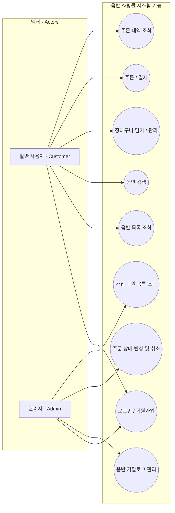
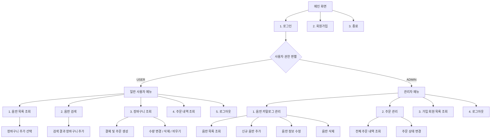

# 💿 음반 판매 쇼핑몰 콘솔 프로그램 (Album Store Console Application)

---

## 📂 프로젝트 모듈 구조 (Directory Structure)

코드는 기능별로 역할을 명확히 분리하여 모듈화(Modularization)되었습니다.

```text
homework/
├── data/                  # 데이터 파일 저장 폴더 (JSON)
│   ├── albums.json
│   ├── orders.json
│   └── users.json
├── models/                # 도메인 엔티티 클래스 정의 (Domain Models)
│   ├── __init__.py
│   ├── album.py
│   ├── order.py
│   └── user.py
├── dao/                   # 데이터 접근 객체 (Data Access Objects)
│   ├── __init__.py
│   ├── base_dao.py
│   ├── album_dao.py
│   ├── order_dao.py
│   └── user_dao.py
├── service/               # 비즈니스 로직 처리 (Business Logic Services)
│   ├── __init__.py
│   ├── album_service.py
│   ├── order_service.py
│   └── user_service.py
├── ui/                    # 사용자 인터페이스 (Console UI)
│   ├── __init__.py
│   ├── console_utils.py
│   ├── admin_menu.py
│   └── user_menu.py
├── main.py                # 프로그램 진입점 (Entry Point)
├── shell.nix              # 개발 환경 설정 파일
└── README.md              # 프로젝트 문서화 파일 (본 파일)
```

---

## 📊 설계 다이어그램 (Design Diagrams)

### 1. 유스케이스 다이어그램 (Use Case Diagram)

프로그램이 지원하는 행위자(Actor)와 유스케이스(Use Case)의 관계를 도식화한 그림입니다.



---

### 2. 메뉴 구성도 (Menu Structure Diagram)

사용자가 보게 되는 콘솔 메뉴의 흐름과 구조입니다.



---

### 3. 클래스 다이어그램 (Class Diagram)

각 도메인 모델과 데이터 접근 레이어(DAO), 서비스 레이어(Service) 간의 구조적 관계를 보여줍니다.

```mermaid
classDiagram
    class User {
        +int id
        +str username
        +str password
        +str name
        +str role
        +to_dict() dict
        +from_dict(data) User
    }
    class Album {
        +int id
        +str title
        +str artist
        +str genre
        +int price
        +int stock
        +to_dict() dict
        +from_dict(data) Album
    }
    class OrderItem {
        +int album_id
        +str album_title
        +int quantity
        +int price
        +to_dict() dict
        +from_dict(data) OrderItem
    }
    class Order {
        +int id
        +str user_username
        +list~OrderItem~ items
        +int total_price
        +str status
        +str order_date
        +to_dict() dict
        +from_dict(data) Order
    }

    class BaseDAO {
        +str file_path
        #_ensure_file_exists()
        #_read_all() list
        #_write_all(data)
    }

    class UserDAO {
        +find_all() list~User~
        +find_by_username(username) User
        +insert(user) User
        +update(user) bool
    }

    class AlbumDAO {
        +find_all() list~Album~
        +find_by_id(id) Album
        +insert(album) Album
        +update(album) bool
        +delete(id) bool
    }

    class OrderDAO {
        +find_all() list~Order~
        +find_by_id(id) Order
        +find_by_username(username) list~Order~
        +insert(order) Order
        +update(order) bool
    }

    BaseDAO <|-- UserDAO
    BaseDAO <|-- AlbumDAO
    BaseDAO <|-- OrderDAO

    class UserService {
        -UserDAO user_dao
        +register(username, password, name, role) User
        +login(username, password) User
    }

    class AlbumService {
        -AlbumDAO album_dao
        +get_all_albums() list~Album~
        +get_album_by_id(id) Album
        +search_albums(keyword, search_type) list~Album~
        +add_album(title, artist, genre, price, stock) Album
        +update_album(id, title, artist, genre, price, stock) Album
        +delete_album(id) bool
    }

    class OrderService {
        -OrderDAO order_dao
        -AlbumDAO album_dao
        +checkout(username, cart) Order
        +get_user_orders(username) list~Order~
        +get_all_orders() list~Order~
        +update_order_status(id, new_status) Order
    }

    UserService --> UserDAO
    AlbumService --> AlbumDAO
    OrderService --> OrderDAO
    OrderService --> AlbumDAO

    Order "1" *-- "*" OrderItem
```



---

## 🛠️ Data Access Object (DAO) 패턴 구조 설명

### 1. DAO 패턴 정의 및 목적
**DAO(Data Access Object) 패턴**은 데이터베이스나 파일 같은 물리적인 데이터 저장소와의 비즈니스 로직을 분리하기 위해 사용하는 디자인 패턴입니다.
이 패턴을 적용하는 핵심 이유는 다음과 같습니다:
- **역할 분담 (Separation of Concerns):** 비즈니스 로직을 처리하는 `Service` 영역은 데이터가 어떻게 저장되는지(JSON 파일, SQL 데이터베이스, 메모리 등) 신경 쓸 필요 없이 데이터의 조회/등록만 호출합니다.
- **유지보수성 향상:** 향후 파일(JSON) 대신 SQLite나 MySQL 같은 관계형 데이터베이스(RDBMS)로 저장 방식을 변경하더라도, `Service`나 `UI` 코드는 전혀 수정할 필요 없이 DAO 구현 클래스만 수정하면 됩니다.

### 2. 본 프로젝트에서의 구현 방식
- **`BaseDAO`:** 파일 입출력 및 디렉토리 자동 생성, 공통 JSON 읽기/쓰기 작업을 처리하는 상위 추상/공통 클래스입니다.
- **`UserDAO`, `AlbumDAO`, `OrderDAO`:** `BaseDAO`를 상속받아 각각의 데이터 형식에 맞게 데이터를 모델 객체 리스트로 변환(Deserialization)하고, 데이터를 추가/수정/삭제 후 다시 JSON 파일로 기록(Serialization)합니다.
- **자동 ID 생성:** 데이터 추가 시 기존 데이터의 최대 ID값을 파악하여 자동으로 `ID + 1`을 부여하는 논리적인 Auto-Increment 기능이 DAO 내부에 구현되어 있습니다.

---

## 🚀 프로그램 실행 방법

### 요구사항 (Prerequisites)
- Python 3.x가 설치되어 있어야 합니다.

### 실행 명령어
프로젝트 루트 디렉토리 `/home/jihoo/homework` 에서 다음 명령어를 실행합니다:

```bash
python3 main.py
```

### 테스트용 기본 제공 계정 (Test Accounts)
프로그램을 처음 실행하면 샘플 음반 데이터와 테스트용 계정이 자동으로 초기화됩니다.

1. **일반 사용자 계정:**
   - **아이디:** `user1`
   - **비밀번호:** `123`
   - **설명:** 음반 목록을 둘러보고 장바구니에 담아 가상 구매(결제)를 해볼 수 있습니다.
2. **관리자 계정:**
   - **아이디:** `admin`
   - **비밀번호:** `123`
   - **설명:** 신규 음반 등록/수정/삭제가 가능하며 전체 사용자의 주문 내역을 모니터링하고 주문 처리 상태(준비중/배송중/배송완료/주문취소)를 변경할 수 있습니다.
